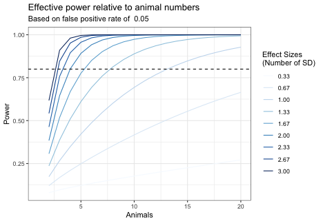

---
title: "Power Analysis Sample"
author: "Dave Bridges"
date: "February 18, 2018"
output:
  html_document:
    highlight: tango
    keep_md: yes
    number_sections: no
    toc: yes
  pdf_document:
    highlight: tango
    keep_tex: yes
    number_sections: no
    toc: yes
---


These data can be found in /Users/davebrid/Documents/GitHub/Lab-Documents/Experimental Policies/Power Analysis and this script was most recently run on Thu May 30 14:23:27 2019.

# Power Analysis


```r
library(pwr)
#desired effect size in standard deviations
effect.size <- 5 # expected difference in absolute terms
assay.sd <- 3 # the standard deviation of the assay, in the same units as the effect size
effect.size.sd <- effect.size/assay.sd
#desired false positive rate
fpr <- 0.05
#desired power (inverse of false negative rate)
power <- 0.8
#calculate required n
required.animals <- pwr.t.test(d=effect.size.sd,
                               power=power,
                               sig.level=fpr,
                               alternative="greater",
                               type="two.sample")$n
```

The assumptions set in this analysis are:

* The desired effect size is 5.  This is what we want to power our analysis to be able to detect.
* The standard deviation of the measurement is 3, in the same units as the effect size.
* Therefore Cohen's *d* is 1.667 or the number of standard deviations we want to be able to detect.
* The acceptable false positive rate is 0.05.  This is the percent chance that we observe something that is not actually true.
* The acceptable false negative rate is 0.2.  This is the percent chance that we miss something that is actually true.
* The power of our analysis is set at 0.8.

## Calculate Number of Animals

At a standard power of 0.8 with a false positive rate of 0.05 and a desired effect size of a 5 difference in percent fat mass we would need **5.283** animals in each group.

## Calculate Detectable Effect Size


```r
required.animals.effect <- round(required.animals)
effective.d <- pwr.t.test(power=power,
                               n=required.animals.effect,
                               sig.level=fpr,
                               alternative="greater",
                               type="two.sample")$d
```

Based on the design above we should expect to detect an effect size of 1.725 standard deviations with 0.8 power, 5 animals and a FPR of 0.05.

## Calculate Effective Power


```r
required.animals.power <- round(required.animals)
effective.power <- pwr.t.test(d=effect.size.sd,
                               n=required.animals.power,
                               sig.level=fpr,
                               alternative="greater",
                               type="two.sample")$power
```

Based on the design above we have a 77.599% chance of seeing a difference of 1.667 with 5 animals and a FPR of 0.05.

The plot below shows how likely we are to detect a difference (the power) as we vary the number of animals (x-axis) and the desired effect size.


```r
animals <- seq(1:20) #animal range to test
effect.sizes <- seq(1,9,by=1) # effect size range to test
power.table <- expand.grid(animals=animals,effect.sizes=effect.sizes)
power.table$effect.sizes.sd <- power.table$effect.sizes/assay.sd

for (effect.size.sd in power.table$effect.sizes.sd){
for (n.test in power.table$animals){
  power.table[power.table$animals==n.test&power.table$effect.sizes.sd==effect.size.sd,'power'] <- 
    pwr.t.test(d=effect.size.sd,
               n=n.test,
               sig.level=fpr,
               alternative="greater",
               type="two.sample")$power
}
}


library(ggplot2)
library(RColorBrewer)

power.table$effect.sizes.sd <- as.factor(format(round(power.table$effect.sizes.sd,2),nsmall=2))
p <- ggplot(power.table, aes(y=power,x=animals))
p + geom_line(aes(col=effect.sizes.sd)) +
  labs(y="Power",
       x="Animals",
       title="Effective power relative to animal numbers",
       subtitle=paste("Based on false positive rate of ", fpr)) +
  geom_hline(yintercept=0.8, lty=2) + 
  scale_colour_manual("Effect Sizes \n(Number of SD)", values=brewer.pal(10,'Blues'))
```

<!-- -->

# Session Information


```r
sessionInfo()
```

```
## R version 3.5.0 (2018-04-23)
## Platform: x86_64-apple-darwin15.6.0 (64-bit)
## Running under: macOS  10.14.5
## 
## Matrix products: default
## BLAS: /Library/Frameworks/R.framework/Versions/3.5/Resources/lib/libRblas.0.dylib
## LAPACK: /Library/Frameworks/R.framework/Versions/3.5/Resources/lib/libRlapack.dylib
## 
## locale:
## [1] en_US.UTF-8/en_US.UTF-8/en_US.UTF-8/C/en_US.UTF-8/en_US.UTF-8
## 
## attached base packages:
## [1] stats     graphics  grDevices utils     datasets  methods   base     
## 
## other attached packages:
## [1] RColorBrewer_1.1-2 pwr_1.2-2          ggplot2_3.1.0     
## [4] dplyr_0.7.8        tidyr_0.8.2        knitr_1.21        
## 
## loaded via a namespace (and not attached):
##  [1] Rcpp_1.0.0       bindr_0.1.1      magrittr_1.5     munsell_0.5.0   
##  [5] tidyselect_0.2.5 colorspace_1.3-2 R6_2.3.0         rlang_0.3.1     
##  [9] plyr_1.8.4       stringr_1.3.1    tools_3.5.0      grid_3.5.0      
## [13] gtable_0.2.0     xfun_0.4         withr_2.1.2      htmltools_0.3.6 
## [17] lazyeval_0.2.1   yaml_2.2.0       digest_0.6.18    assertthat_0.2.0
## [21] tibble_2.0.0     crayon_1.3.4     bindrcpp_0.2.2   purrr_0.2.5     
## [25] glue_1.3.0       evaluate_0.12    rmarkdown_1.11   labeling_0.3    
## [29] stringi_1.2.4    compiler_3.5.0   pillar_1.3.1     scales_1.0.0    
## [33] pkgconfig_2.0.2
```
