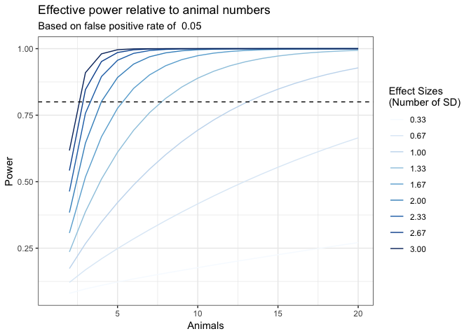

---
title: "Power Analysis Sample"
author: "Dave Bridges"
date: "February 18, 2018"
output:
  html_document:
    highlight: tango
    keep_md: yes
    number_sections: yes
    toc: yes
  pdf_document:
    highlight: tango
    keep_tex: yes
    number_sections: yes
    toc: yes
---


These data can be found in /Users/davebrid/Documents/GitHub/Lab-Documents/Experimental Policies/Power Analysis and this script was most recently run on Sun Feb 18 14:57:54 2018.

# Power Analysis


The assumptions set in this analysis are:

* The desired effect size is 5.  This is what we want to power our analysis to be able to detect.
* The standard deviation of the measurement is 3, in the same units as the effect size.
* Therefore Cohen's *d* is 1.667 or the number of standard deviations we want to be able to detect.
* The acceptable false positive rate is 0.05.  This is the percent chance that we observe something that is not actually true.
* The acceptable false negative rate is 0.2.  This is the percent chance that we miss something that is actually true.
* The power of our analysis is set at 0.8.

## Calculate Number of Animals

At a standard power of 0.8 with a false positive rate of 0.05 and a desired effect size of a 5 difference in percent fat mass we would need **5.283** animals in each group.

## Calculate Effective Power

The plot below shows how likely we are to detect a difference (the power) as we vary the number of animals (x-axis) and the desired effect size.

<!-- -->

# Session Information


```
## R version 3.4.2 (2017-09-28)
## Platform: x86_64-apple-darwin15.6.0 (64-bit)
## Running under: macOS High Sierra 10.13.3
## 
## Matrix products: default
## BLAS: /Library/Frameworks/R.framework/Versions/3.4/Resources/lib/libRblas.0.dylib
## LAPACK: /Library/Frameworks/R.framework/Versions/3.4/Resources/lib/libRlapack.dylib
## 
## locale:
## [1] en_US.UTF-8/en_US.UTF-8/en_US.UTF-8/C/en_US.UTF-8/en_US.UTF-8
## 
## attached base packages:
## [1] stats     graphics  grDevices utils     datasets  methods   base     
## 
## other attached packages:
## [1] RColorBrewer_1.1-2 pwr_1.2-1          ggplot2_2.2.1     
## [4] dplyr_0.7.4        tidyr_0.7.2        knitr_1.17        
## 
## loaded via a namespace (and not attached):
##  [1] Rcpp_0.12.14     bindr_0.1        magrittr_1.5     munsell_0.4.3   
##  [5] colorspace_1.3-2 R6_2.2.2         rlang_0.1.4      plyr_1.8.4      
##  [9] stringr_1.2.0    tools_3.4.2      grid_3.4.2       gtable_0.2.0    
## [13] htmltools_0.3.6  lazyeval_0.2.1   yaml_2.1.15      rprojroot_1.2   
## [17] digest_0.6.12    assertthat_0.2.0 tibble_1.3.4     bindrcpp_0.2    
## [21] purrr_0.2.4      glue_1.2.0       evaluate_0.10.1  rmarkdown_1.8   
## [25] labeling_0.3     stringi_1.1.6    compiler_3.4.2   scales_0.5.0    
## [29] backports_1.1.1  pkgconfig_2.0.1
```
