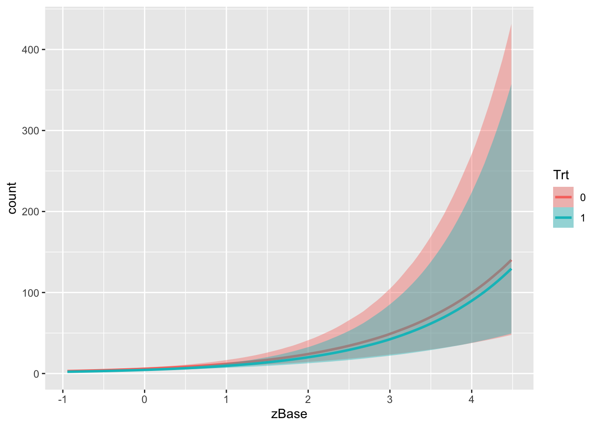
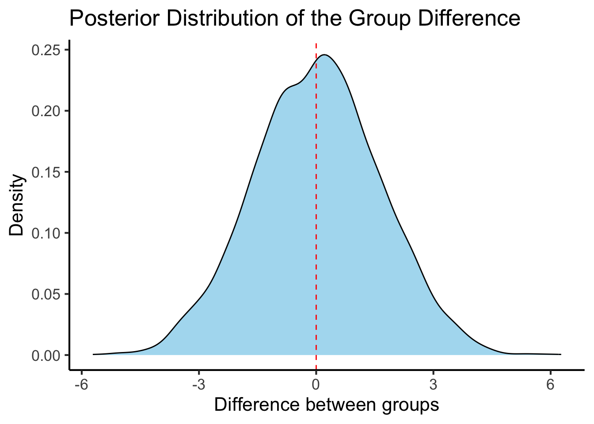
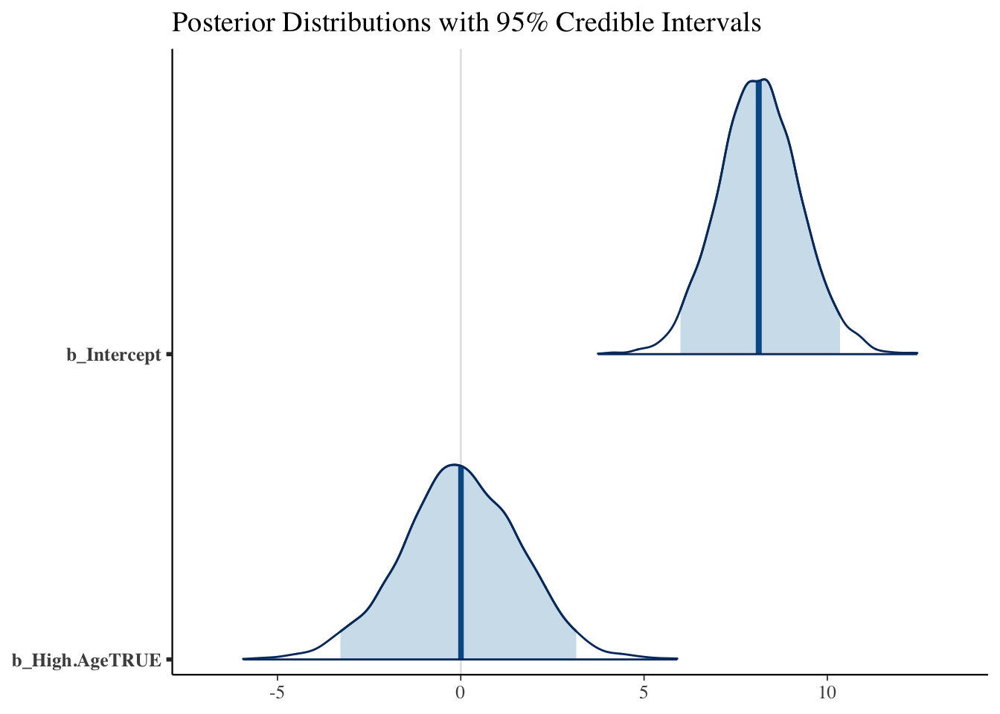

While we most often use classical frequentist statistical approaches, the norm in the molecular physiology field, I have been thinking a lot about Bayesian approaches, especially from a public health and nutrition perspective.  In these fields the data tend to be less clear and I find myself updating my opinions often based on new data.  

### How Much Protein is Optimal Post-Exercise

One example is the question of how much protein is optimal post-resistance training workout.  I had been teaching for years that the max was 20-30g and beyond that there wsa no advantage.  This was based on several feeding experiments with whey protein looking at muscle protein synthesis as the endpoint.  However in December a provocative paper came out showing that up to 100g could be absorbed and stored and that the true maximum may be higher.  There are several important differences in this study including a more natural protein source (milk proteins mostly a combination of whey and casein, compared with casein alone) and much more rigorous endpoints by the use of stable isotopes.  I am a cynical person by nature, but this paper made me change my opinion greatly.  In other words by prior hypothesis (max protein uptake is 20-30g) was updated by new data (this new paper) and my new posterior opinion suggests the levels might be higher.  Fundamentally this happens to me a lot when newer (or better) data updates our understanding of the world and we update the likliehood of something being true.  This is an example of inferential Bayesian reasoning.  The math behind this is this (from https://en.wikipedia.org/wiki/Bayesian_inference):


* $P(H|E)$ is the probability of hypothesis A given that data B was obtained.  Also known as the *posterior probability*.
* $P(E|H)$ is the probability of observing E given this hypothesis
* $P(H)$ is the probability of the hypothesis before hte data (the *prior probability*)
* $P(E)$ is the probability of the evidence, or the *marginal liklihood*

Together these are connected by Bayes' rule

$$P(H|E) = \frac{P(E|H)P(H)}{P(E)} $$
In other words my prior hypothesis (max protein post workout is 20-30g; $P(H)$ was updated by this new data (represented by $\frac{P(E|H)}{P(E)}$) to give me an updated posterior probability of that hypothesis being true given this evidence ($P(H|E)$).  Roughly I would say i had about 70% certainty that 20-30g was the maximum before the study but now only about ~10% certainty after reading that study, so re-arranging we would get:

$$
0.1 = \frac{P(E|H)}{P(E)} \times 0.7
$$
$$
\frac{P(E|H)}{P(E)} = 0.1/0.7 = 0.07
$$

0.07 is much less than one, so based on my rough estimate the study changed my opinion by $1/0.07=~14$ fold, a value which is known as the Bayes Factor.

## What is a Bayesian Analysis 


::: {.cell}

```{.r .cell-code}
library(brms)
```

::: {.cell-output .cell-output-stderr}

```
Loading required package: Rcpp
```


:::

::: {.cell-output .cell-output-stderr}

```
Loading 'brms' package (version 2.21.0). Useful instructions
can be found by typing help('brms'). A more detailed introduction
to the package is available through vignette('brms_overview').
```


:::

::: {.cell-output .cell-output-stderr}

```

Attaching package: 'brms'
```


:::

::: {.cell-output .cell-output-stderr}

```
The following object is masked from 'package:stats':

    ar
```


:::

```{.r .cell-code}
fit1 <- brm(count ~ zAge + zBase * Trt + (1|patient),
            data = epilepsy, family = poisson())
```

::: {.cell-output .cell-output-stderr}

```
Compiling Stan program...
```


:::

::: {.cell-output .cell-output-stderr}

```
Trying to compile a simple C file
```


:::

::: {.cell-output .cell-output-stdout}

```
Running /Library/Frameworks/R.framework/Resources/bin/R CMD SHLIB foo.c
using C compiler: ‘Apple clang version 15.0.0 (clang-1500.3.9.4)’
using SDK: ‘MacOSX14.4.sdk’
clang -arch x86_64 -I"/Library/Frameworks/R.framework/Resources/include" -DNDEBUG   -I"/Library/Frameworks/R.framework/Versions/4.4-x86_64/Resources/library/Rcpp/include/"  -I"/Library/Frameworks/R.framework/Versions/4.4-x86_64/Resources/library/RcppEigen/include/"  -I"/Library/Frameworks/R.framework/Versions/4.4-x86_64/Resources/library/RcppEigen/include/unsupported"  -I"/Library/Frameworks/R.framework/Versions/4.4-x86_64/Resources/library/BH/include" -I"/Library/Frameworks/R.framework/Versions/4.4-x86_64/Resources/library/StanHeaders/include/src/"  -I"/Library/Frameworks/R.framework/Versions/4.4-x86_64/Resources/library/StanHeaders/include/"  -I"/Library/Frameworks/R.framework/Versions/4.4-x86_64/Resources/library/RcppParallel/include/"  -I"/Library/Frameworks/R.framework/Versions/4.4-x86_64/Resources/library/rstan/include" -DEIGEN_NO_DEBUG  -DBOOST_DISABLE_ASSERTS  -DBOOST_PENDING_INTEGER_LOG2_HPP  -DSTAN_THREADS  -DUSE_STANC3 -DSTRICT_R_HEADERS  -DBOOST_PHOENIX_NO_VARIADIC_EXPRESSION  -D_HAS_AUTO_PTR_ETC=0  -include '/Library/Frameworks/R.framework/Versions/4.4-x86_64/Resources/library/StanHeaders/include/stan/math/prim/fun/Eigen.hpp'  -D_REENTRANT -DRCPP_PARALLEL_USE_TBB=1   -I/opt/R/x86_64/include    -fPIC  -falign-functions=64 -Wall -g -O2  -c foo.c -o foo.o
In file included from <built-in>:1:
In file included from /Library/Frameworks/R.framework/Versions/4.4-x86_64/Resources/library/StanHeaders/include/stan/math/prim/fun/Eigen.hpp:22:
In file included from /Library/Frameworks/R.framework/Versions/4.4-x86_64/Resources/library/RcppEigen/include/Eigen/Dense:1:
In file included from /Library/Frameworks/R.framework/Versions/4.4-x86_64/Resources/library/RcppEigen/include/Eigen/Core:19:
/Library/Frameworks/R.framework/Versions/4.4-x86_64/Resources/library/RcppEigen/include/Eigen/src/Core/util/Macros.h:679:10: fatal error: 'cmath' file not found
#include <cmath>
         ^~~~~~~
1 error generated.
make: *** [foo.o] Error 1
```


:::

::: {.cell-output .cell-output-stderr}

```
Start sampling
```


:::

::: {.cell-output .cell-output-stdout}

```

SAMPLING FOR MODEL 'anon_model' NOW (CHAIN 1).
Chain 1: 
Chain 1: Gradient evaluation took 7.4e-05 seconds
Chain 1: 1000 transitions using 10 leapfrog steps per transition would take 0.74 seconds.
Chain 1: Adjust your expectations accordingly!
Chain 1: 
Chain 1: 
Chain 1: Iteration:    1 / 2000 [  0%]  (Warmup)
Chain 1: Iteration:  200 / 2000 [ 10%]  (Warmup)
Chain 1: Iteration:  400 / 2000 [ 20%]  (Warmup)
Chain 1: Iteration:  600 / 2000 [ 30%]  (Warmup)
Chain 1: Iteration:  800 / 2000 [ 40%]  (Warmup)
Chain 1: Iteration: 1000 / 2000 [ 50%]  (Warmup)
Chain 1: Iteration: 1001 / 2000 [ 50%]  (Sampling)
Chain 1: Iteration: 1200 / 2000 [ 60%]  (Sampling)
Chain 1: Iteration: 1400 / 2000 [ 70%]  (Sampling)
Chain 1: Iteration: 1600 / 2000 [ 80%]  (Sampling)
Chain 1: Iteration: 1800 / 2000 [ 90%]  (Sampling)
Chain 1: Iteration: 2000 / 2000 [100%]  (Sampling)
Chain 1: 
Chain 1:  Elapsed Time: 1.349 seconds (Warm-up)
Chain 1:                1.004 seconds (Sampling)
Chain 1:                2.353 seconds (Total)
Chain 1: 

SAMPLING FOR MODEL 'anon_model' NOW (CHAIN 2).
Chain 2: 
Chain 2: Gradient evaluation took 1.5e-05 seconds
Chain 2: 1000 transitions using 10 leapfrog steps per transition would take 0.15 seconds.
Chain 2: Adjust your expectations accordingly!
Chain 2: 
Chain 2: 
Chain 2: Iteration:    1 / 2000 [  0%]  (Warmup)
Chain 2: Iteration:  200 / 2000 [ 10%]  (Warmup)
Chain 2: Iteration:  400 / 2000 [ 20%]  (Warmup)
Chain 2: Iteration:  600 / 2000 [ 30%]  (Warmup)
Chain 2: Iteration:  800 / 2000 [ 40%]  (Warmup)
Chain 2: Iteration: 1000 / 2000 [ 50%]  (Warmup)
Chain 2: Iteration: 1001 / 2000 [ 50%]  (Sampling)
Chain 2: Iteration: 1200 / 2000 [ 60%]  (Sampling)
Chain 2: Iteration: 1400 / 2000 [ 70%]  (Sampling)
Chain 2: Iteration: 1600 / 2000 [ 80%]  (Sampling)
Chain 2: Iteration: 1800 / 2000 [ 90%]  (Sampling)
Chain 2: Iteration: 2000 / 2000 [100%]  (Sampling)
Chain 2: 
Chain 2:  Elapsed Time: 1.354 seconds (Warm-up)
Chain 2:                0.96 seconds (Sampling)
Chain 2:                2.314 seconds (Total)
Chain 2: 

SAMPLING FOR MODEL 'anon_model' NOW (CHAIN 3).
Chain 3: 
Chain 3: Gradient evaluation took 1.5e-05 seconds
Chain 3: 1000 transitions using 10 leapfrog steps per transition would take 0.15 seconds.
Chain 3: Adjust your expectations accordingly!
Chain 3: 
Chain 3: 
Chain 3: Iteration:    1 / 2000 [  0%]  (Warmup)
Chain 3: Iteration:  200 / 2000 [ 10%]  (Warmup)
Chain 3: Iteration:  400 / 2000 [ 20%]  (Warmup)
Chain 3: Iteration:  600 / 2000 [ 30%]  (Warmup)
Chain 3: Iteration:  800 / 2000 [ 40%]  (Warmup)
Chain 3: Iteration: 1000 / 2000 [ 50%]  (Warmup)
Chain 3: Iteration: 1001 / 2000 [ 50%]  (Sampling)
Chain 3: Iteration: 1200 / 2000 [ 60%]  (Sampling)
Chain 3: Iteration: 1400 / 2000 [ 70%]  (Sampling)
Chain 3: Iteration: 1600 / 2000 [ 80%]  (Sampling)
Chain 3: Iteration: 1800 / 2000 [ 90%]  (Sampling)
Chain 3: Iteration: 2000 / 2000 [100%]  (Sampling)
Chain 3: 
Chain 3:  Elapsed Time: 1.316 seconds (Warm-up)
Chain 3:                1.037 seconds (Sampling)
Chain 3:                2.353 seconds (Total)
Chain 3: 

SAMPLING FOR MODEL 'anon_model' NOW (CHAIN 4).
Chain 4: 
Chain 4: Gradient evaluation took 1.6e-05 seconds
Chain 4: 1000 transitions using 10 leapfrog steps per transition would take 0.16 seconds.
Chain 4: Adjust your expectations accordingly!
Chain 4: 
Chain 4: 
Chain 4: Iteration:    1 / 2000 [  0%]  (Warmup)
Chain 4: Iteration:  200 / 2000 [ 10%]  (Warmup)
Chain 4: Iteration:  400 / 2000 [ 20%]  (Warmup)
Chain 4: Iteration:  600 / 2000 [ 30%]  (Warmup)
Chain 4: Iteration:  800 / 2000 [ 40%]  (Warmup)
Chain 4: Iteration: 1000 / 2000 [ 50%]  (Warmup)
Chain 4: Iteration: 1001 / 2000 [ 50%]  (Sampling)
Chain 4: Iteration: 1200 / 2000 [ 60%]  (Sampling)
Chain 4: Iteration: 1400 / 2000 [ 70%]  (Sampling)
Chain 4: Iteration: 1600 / 2000 [ 80%]  (Sampling)
Chain 4: Iteration: 1800 / 2000 [ 90%]  (Sampling)
Chain 4: Iteration: 2000 / 2000 [100%]  (Sampling)
Chain 4: 
Chain 4:  Elapsed Time: 1.278 seconds (Warm-up)
Chain 4:                0.956 seconds (Sampling)
Chain 4:                2.234 seconds (Total)
Chain 4: 
```


:::

```{.r .cell-code}
summary(fit1)
```

::: {.cell-output .cell-output-stdout}

```
 Family: poisson 
  Links: mu = log 
Formula: count ~ zAge + zBase * Trt + (1 | patient) 
   Data: epilepsy (Number of observations: 236) 
  Draws: 4 chains, each with iter = 2000; warmup = 1000; thin = 1;
         total post-warmup draws = 4000

Multilevel Hyperparameters:
~patient (Number of levels: 59) 
              Estimate Est.Error l-95% CI u-95% CI Rhat Bulk_ESS Tail_ESS
sd(Intercept)     0.58      0.07     0.47     0.73 1.01      935     1759

Regression Coefficients:
           Estimate Est.Error l-95% CI u-95% CI Rhat Bulk_ESS Tail_ESS
Intercept      1.77      0.12     1.53     2.00 1.00      693     1398
zAge           0.09      0.08    -0.08     0.26 1.00      772     1228
zBase          0.71      0.12     0.47     0.95 1.00      850     1271
Trt1          -0.27      0.17    -0.59     0.07 1.00      669     1220
zBase:Trt1     0.04      0.17    -0.28     0.37 1.00      879     1609

Draws were sampled using sampling(NUTS). For each parameter, Bulk_ESS
and Tail_ESS are effective sample size measures, and Rhat is the potential
scale reduction factor on split chains (at convergence, Rhat = 1).
```


:::

```{.r .cell-code}
plot(fit1, variable = c("b_Trt1", "b_zBase"))
```

::: {.cell-output-display}
{width=672}
:::

```{.r .cell-code}
plot(conditional_effects(fit1, effects = "zBase:Trt"))
```

::: {.cell-output-display}
{width=672}
:::

```{.r .cell-code}
library(dplyr)
```

::: {.cell-output .cell-output-stderr}

```

Attaching package: 'dplyr'
```


:::

::: {.cell-output .cell-output-stderr}

```
The following objects are masked from 'package:stats':

    filter, lag
```


:::

::: {.cell-output .cell-output-stderr}

```
The following objects are masked from 'package:base':

    intersect, setdiff, setequal, union
```


:::

```{.r .cell-code}
epilepsy2 <-
  epilepsy %>%
  mutate(High.Age = zAge>median(zAge))
fit <- brm(
  count ~ High.Age,
  data = epilepsy2, 
  #family = poisson(),
  cores = 4,
  sample_prior = TRUE  # Important for hypothesis testing
)
```

::: {.cell-output .cell-output-stderr}

```
Compiling Stan program...
```


:::

::: {.cell-output .cell-output-stderr}

```
Trying to compile a simple C file
```


:::

::: {.cell-output .cell-output-stdout}

```
Running /Library/Frameworks/R.framework/Resources/bin/R CMD SHLIB foo.c
using C compiler: ‘Apple clang version 15.0.0 (clang-1500.3.9.4)’
using SDK: ‘MacOSX14.4.sdk’
clang -arch x86_64 -I"/Library/Frameworks/R.framework/Resources/include" -DNDEBUG   -I"/Library/Frameworks/R.framework/Versions/4.4-x86_64/Resources/library/Rcpp/include/"  -I"/Library/Frameworks/R.framework/Versions/4.4-x86_64/Resources/library/RcppEigen/include/"  -I"/Library/Frameworks/R.framework/Versions/4.4-x86_64/Resources/library/RcppEigen/include/unsupported"  -I"/Library/Frameworks/R.framework/Versions/4.4-x86_64/Resources/library/BH/include" -I"/Library/Frameworks/R.framework/Versions/4.4-x86_64/Resources/library/StanHeaders/include/src/"  -I"/Library/Frameworks/R.framework/Versions/4.4-x86_64/Resources/library/StanHeaders/include/"  -I"/Library/Frameworks/R.framework/Versions/4.4-x86_64/Resources/library/RcppParallel/include/"  -I"/Library/Frameworks/R.framework/Versions/4.4-x86_64/Resources/library/rstan/include" -DEIGEN_NO_DEBUG  -DBOOST_DISABLE_ASSERTS  -DBOOST_PENDING_INTEGER_LOG2_HPP  -DSTAN_THREADS  -DUSE_STANC3 -DSTRICT_R_HEADERS  -DBOOST_PHOENIX_NO_VARIADIC_EXPRESSION  -D_HAS_AUTO_PTR_ETC=0  -include '/Library/Frameworks/R.framework/Versions/4.4-x86_64/Resources/library/StanHeaders/include/stan/math/prim/fun/Eigen.hpp'  -D_REENTRANT -DRCPP_PARALLEL_USE_TBB=1   -I/opt/R/x86_64/include    -fPIC  -falign-functions=64 -Wall -g -O2  -c foo.c -o foo.o
In file included from <built-in>:1:
In file included from /Library/Frameworks/R.framework/Versions/4.4-x86_64/Resources/library/StanHeaders/include/stan/math/prim/fun/Eigen.hpp:22:
In file included from /Library/Frameworks/R.framework/Versions/4.4-x86_64/Resources/library/RcppEigen/include/Eigen/Dense:1:
In file included from /Library/Frameworks/R.framework/Versions/4.4-x86_64/Resources/library/RcppEigen/include/Eigen/Core:19:
/Library/Frameworks/R.framework/Versions/4.4-x86_64/Resources/library/RcppEigen/include/Eigen/src/Core/util/Macros.h:679:10: fatal error: 'cmath' file not found
#include <cmath>
         ^~~~~~~
1 error generated.
make: *** [foo.o] Error 1
```


:::

::: {.cell-output .cell-output-stderr}

```
Start sampling
```


:::

```{.r .cell-code}
hypothesis(fit, "High.AgeTRUE > 0")
```

::: {.cell-output .cell-output-stdout}

```
Hypothesis Tests for class b:
          Hypothesis Estimate Est.Error CI.Lower CI.Upper Evid.Ratio Post.Prob
1 (High.AgeTRUE) > 0     0.03      1.61    -2.64     2.68       1.05      0.51
  Star
1     
---
'CI': 90%-CI for one-sided and 95%-CI for two-sided hypotheses.
'*': For one-sided hypotheses, the posterior probability exceeds 95%;
for two-sided hypotheses, the value tested against lies outside the 95%-CI.
Posterior probabilities of point hypotheses assume equal prior probabilities.
```


:::

```{.r .cell-code}
posterior_samples <- as_draws_df(fit)

library(ggplot2)

ggplot(posterior_samples, aes(x = b_High.AgeTRUE)) +
  geom_density(fill = "skyblue", alpha = 0.7) +
  geom_vline(xintercept = 0, linetype = "dashed", color = "red") +
  labs(title = "Posterior Distribution of the Group Difference",
       x = "Difference between groups",
       y = "Density") +
  theme_classic(base_size=16)
```

::: {.cell-output-display}
{width=672}
:::

```{.r .cell-code}
library(bayesplot)
```

::: {.cell-output .cell-output-stderr}

```
This is bayesplot version 1.11.1
```


:::

::: {.cell-output .cell-output-stderr}

```
- Online documentation and vignettes at mc-stan.org/bayesplot
```


:::

::: {.cell-output .cell-output-stderr}

```
- bayesplot theme set to bayesplot::theme_default()
```


:::

::: {.cell-output .cell-output-stderr}

```
   * Does _not_ affect other ggplot2 plots
```


:::

::: {.cell-output .cell-output-stderr}

```
   * See ?bayesplot_theme_set for details on theme setting
```


:::

::: {.cell-output .cell-output-stderr}

```

Attaching package: 'bayesplot'
```


:::

::: {.cell-output .cell-output-stderr}

```
The following object is masked from 'package:brms':

    rhat
```


:::

```{.r .cell-code}
mcmc_areas(posterior_samples, pars = c("b_Intercept", "b_High.AgeTRUE"),
           prob = 0.95) +
  labs(title = "Posterior Distributions with 95% Credible Intervals")
```

::: {.cell-output-display}
{width=672}
:::
:::