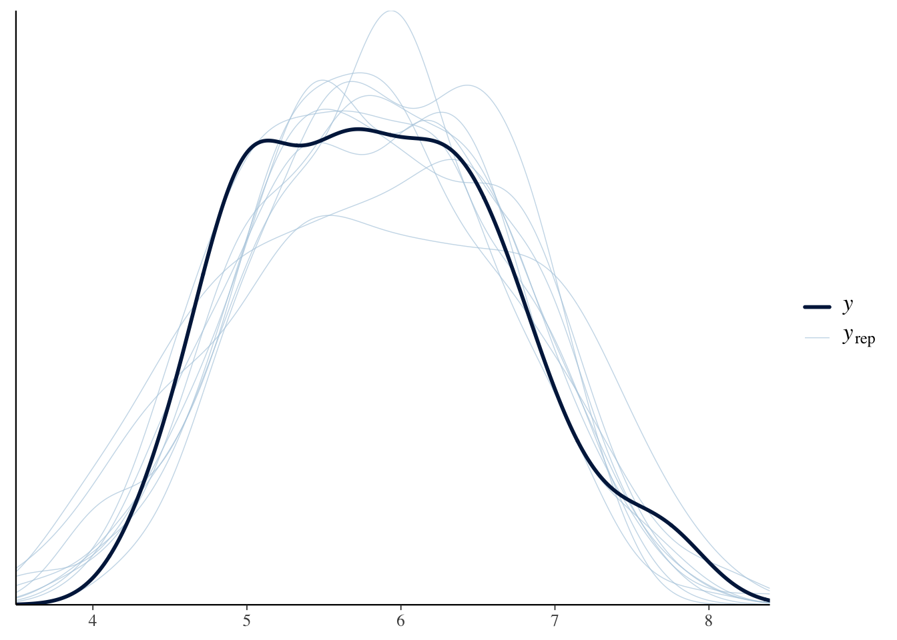
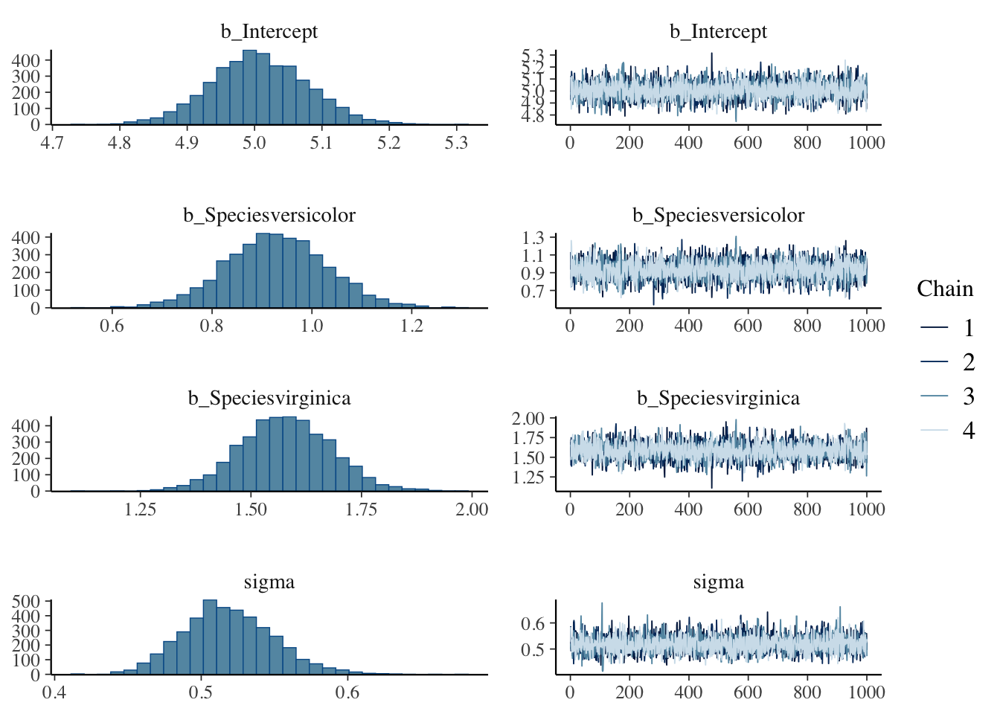
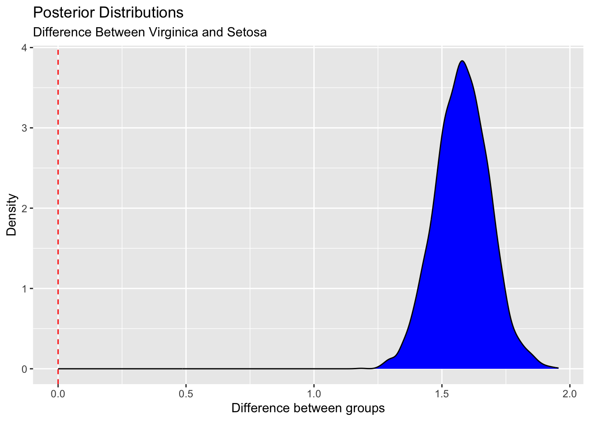
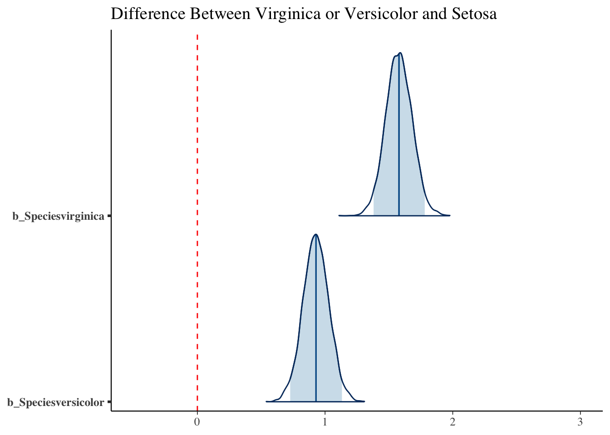
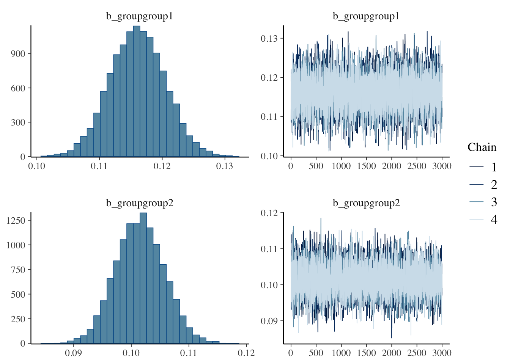
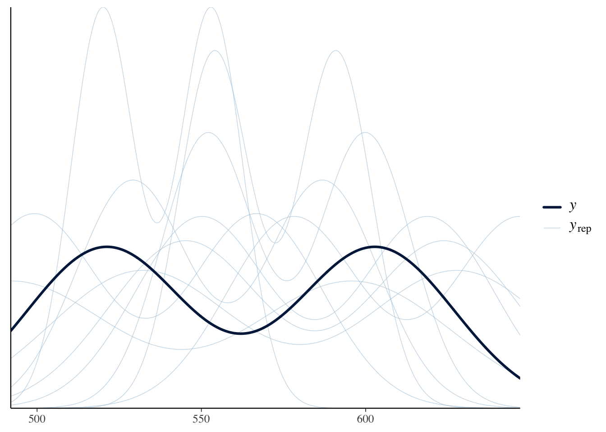

While we most often use classical frequentist statistical approaches, the norm in the molecular physiology field, I have been thinking a lot about Bayesian approaches, especially from a public health and nutrition perspective. In these fields the data tend to be less clear and I find myself updating my opinions often based on new data.

### How Much Protein is Optimal Post-Exercise

One example is the question of how much protein is optimal post-resistance training workout. I had been teaching for years that the max was 20-30g and beyond that there wsa no advantage. This was based on several feeding experiments with whey protein looking at muscle protein synthesis as the endpoint. However in December a provocative paper came out showing that up to 100g could be absorbed and stored and that the true maximum may be higher. There are several important differences in this study including a more natural protein source (milk proteins mostly a combination of whey and casein, compared with casein alone) and much more rigorous endpoints by the use of stable isotopes. I am a cynical person by nature, but this paper made me change my opinion greatly. In other words by prior hypothesis (max protein uptake is 20-30g) was updated by new data (this new paper) and my new posterior opinion suggests the levels might be higher. Fundamentally this happens to me a lot when newer (or better) data updates our understanding of the world and we update the likliehood of something being true. This is an example of inferential Bayesian reasoning. The math behind this is this (from https://en.wikipedia.org/wiki/Bayesian_inference):

-   $P(H|E)$ is the probability of hypothesis A given that data B was obtained. Also known as the *posterior probability*.
-   $P(E|H)$ is the probability of observing E given this hypothesis
-   $P(H)$ is the probability of the hypothesis before hte data (the *prior probability*)
-   $P(E)$ is the probability of the evidence, or the *marginal liklihood*

Together these are connected by Bayes' rule

$$P(H|E) = \frac{P(E|H)P(H)}{P(E)} $$ In other words my prior hypothesis (max protein post workout is 20-30g; $P(H)$ was updated by this new data (represented by $\frac{P(E|H)}{P(E)}$) to give me an updated posterior probability of that hypothesis being true given this evidence ($P(H|E)$). Roughly I would say i had about 70% certainty that 20-30g was the maximum before the study but now only about \~10% certainty after reading that study, so re-arranging we would get:

$$
0.1 = \frac{P(E|H)}{P(E)} \times 0.7
$$ $$
\frac{P(E|H)}{P(E)} = 0.1/0.7 = 0.07
$$

0.07 is much less than one, so based on my rough estimate the study changed my opinion by $1/0.07=~14$ fold. Another way to think about this is to compare the **posterior** probabilities of two hypotheses or models ($BF=\frac{Pr(E|H_1)}{Pr(E|H_2)}$) a value which is known as the Bayes Factor. The $P(E)$ term is not expected to change depending on the hypothesis, because it is the overall probability of the observed data.

### Interpreting a Bayesian Analysis

After this kind of analysis, there are two things we coould report. A *poster probability* ($P(H|E)$; or its distribution) or a Bayes Factor. In one case we are saying that based on our prior probability and our baysian factor we report the posterior probability that a hypothesis is true given the evidence. This means that we use both the Bayes Factor and our prior probability (which could vary among investigators). If we report a Bayes Factor we are reporting how much we expect that these data should modify any prior probability ($P(H)$). This is an important distinction because a Bayes Factor does not make any claims about what the scientist initially thought about how likely a hypothesis was, so is more generalizable. Maybe I had some reason to think that the probability that protein intake max was 20-30g was 70% but another scientist thought it was closer to 90%, we would get different posterior probabilities but the same BF (0.07):

$$P(H|E) = \frac{P(E|H)P(H)}{P(E)} = 0.07 \times 0.7=0.049$$ $$P(H|E) = \frac{P(E|H)P(H)}{P(E)} = 0.07 \times 0.9=0.063$$ There is no p-value in either case. Here we are reporting either a Bayes Factor or a posterior probability. For standardization, Bayes Factors are grouped by Lee and Wagenmakers (https://doi.org/10.1017/CBO9781139087759) as:

-   \<1-3 anecdoctal or barely worth mentioning

-   3-10 moderate evidence

-   10-30 strong evidence

-   30-100 extremely strong evidence

-   

    > 100 extreme evidence

## How to perform Bayesian Analyses

There are several useful R packages to help with this, but i will focus on the [brms package](https://paul-buerkner.github.io/brms/) by Paul-Christian Bürkner. For comparason first lets look at a conventional analysis using the Iris dataset.


::: {.cell}

```{.r .cell-code}
library(knitr)
library(broom)
library(dplyr)
standard.fit <- lm(Sepal.Length~Species, data=iris)
standard.fit %>% 
  anova %>% 
  kable(caption="linear model for sepal length vs species",
        digits=c(2,2,2,2,99))
```

::: {.cell-output-display}


Table: linear model for sepal length vs species

|          |  Df| Sum Sq| Mean Sq| F value|       Pr(>F)|
|:---------|---:|------:|-------:|-------:|------------:|
|Species   |   2|  63.21|   31.61|  119.26| 1.669669e-31|
|Residuals | 147|  38.96|    0.27|      NA|           NA|


:::

```{.r .cell-code}
standard.fit %>% 
  tidy %>% 
  kable(caption="linear model for sepal length vs species",
        digits=c(2,2,2,2,99))
```

::: {.cell-output-display}


Table: linear model for sepal length vs species

|term              | estimate| std.error| statistic|      p.value|
|:-----------------|--------:|---------:|---------:|------------:|
|(Intercept)       |     5.01|      0.07|     68.76| 0.000000e+00|
|Speciesversicolor |     0.93|      0.10|      9.03| 8.770194e-16|
|Speciesvirginica  |     1.58|      0.10|     15.37| 2.214821e-32|


:::
:::


According to this model there is a significant association between species and sepal length, with veriscolor being slightly smaller and virginica being larger than the reference (setosa). Both of these are significiant differences.

Using brms the model specification is the same, though it takes a few seconds longer to compute.


::: {.cell}

```{.r .cell-code}
library(brms)
brms.fit <- brm(Sepal.Length~Species, data=iris,
                family = gaussian(),
                prior = c(
                  set_prior("normal(0, 10)", class = "Intercept"),
                  set_prior("normal(0, 5)", class = "b")),
                sample_prior = TRUE) #required for hypothesis testing
```
:::


Lets walk through this.  First the model call looks similar to before.  We expect the errors to be normally distributed so used a gaussian distribution.  We set our priors as follows:

* Intercept is a value of zero with a sd of 10, fit to a normal distribution
* Beta coefficients are set to a value of zero with a sd of 5.

Both of these are somewhat non-informative priors and presume we know very little about the data.  We could for example use `mean(iris$Sepal.Length)` and `sd(iris$Sepal.Length)` as Intercept priors presuming we know something about the shape of the data but not the effects of the Species.


::: {.cell}

```{.r .cell-code}
summary(brms.fit) 
```

::: {.cell-output .cell-output-stdout}

```
 Family: gaussian 
  Links: mu = identity; sigma = identity 
Formula: Sepal.Length ~ Species 
   Data: iris (Number of observations: 150) 
  Draws: 4 chains, each with iter = 2000; warmup = 1000; thin = 1;
         total post-warmup draws = 4000

Regression Coefficients:
                  Estimate Est.Error l-95% CI u-95% CI Rhat Bulk_ESS Tail_ESS
Intercept             5.01      0.07     4.87     5.15 1.00     3482     2708
Speciesversicolor     0.93      0.10     0.73     1.13 1.00     3518     2975
Speciesvirginica      1.58      0.10     1.38     1.78 1.00     3178     3003

Further Distributional Parameters:
      Estimate Est.Error l-95% CI u-95% CI Rhat Bulk_ESS Tail_ESS
sigma     0.52      0.03     0.46     0.58 1.00     4077     2944

Draws were sampled using sampling(NUTS). For each parameter, Bulk_ESS
and Tail_ESS are effective sample size measures, and Rhat is the potential
scale reduction factor on split chains (at convergence, Rhat = 1).
```


:::

```{.r .cell-code}
pp_check(brms.fit) #checks that posterior probabilities converge
```

::: {.cell-output-display}
{width=672}
:::

```{.r .cell-code}
plot(brms.fit)
```

::: {.cell-output-display}
{width=672}
:::
:::


Several important things appear in this analysis including some default parameters. First the family of the association was assumed to be gaussian, with mu and sigma both linked as identity functions. The regression coefficients table looks slimilar with similar estimages (and no p-values). The Rhat terms of 1.00 indicate convergence which is good, it means that the sampling converged well. There are no p-values

### Hypothesis Testing with BRMS

So how do we get Bayes Factors and posterior probabilities. Lets say we want to test the hypothesis that `Speciesvirginica` was greater than the reference (setosa), that would mean the estimate would have to be greater than zero for this term


::: {.cell}

```{.r .cell-code}
hypothesis(brms.fit, "Speciesvirginica > 0") 
```

::: {.cell-output .cell-output-stdout}

```
Hypothesis Tests for class b:
              Hypothesis Estimate Est.Error CI.Lower CI.Upper Evid.Ratio
1 (Speciesvirginica) > 0     1.58       0.1     1.41     1.75        Inf
  Post.Prob Star
1         1    *
---
'CI': 90%-CI for one-sided and 95%-CI for two-sided hypotheses.
'*': For one-sided hypotheses, the posterior probability exceeds 95%;
for two-sided hypotheses, the value tested against lies outside the 95%-CI.
Posterior probabilities of point hypotheses assume equal prior probabilities.
```


:::
:::


This tabel shows the estimate, error and confidence intervals. The Evid.Ratio (infinity) is the Bayes Factor and the Post.Prob is the posterior probability. This suggests very high (extreme) confidence in that hypothesis being true. But now lets say we only care if virginica is 1.5 units greater than setosa. Those results look like this:


::: {.cell}

```{.r .cell-code}
hypothesis(brms.fit, "Speciesvirginica > 1.5") 
```

::: {.cell-output .cell-output-stdout}

```
Hypothesis Tests for class b:
                Hypothesis Estimate Est.Error CI.Lower CI.Upper Evid.Ratio
1 (Speciesvirginica... > 0     0.08       0.1    -0.09     0.25       3.61
  Post.Prob Star
1      0.78     
---
'CI': 90%-CI for one-sided and 95%-CI for two-sided hypotheses.
'*': For one-sided hypotheses, the posterior probability exceeds 95%;
for two-sided hypotheses, the value tested against lies outside the 95%-CI.
Posterior probabilities of point hypotheses assume equal prior probabilities.
```


:::
:::


As you can see while the estimate is still positive (1.58-1.5=0.08), the Bayes Factor is less confident (3.8, so moderate confidence), and the posterior probability is 79%.

Lets visualize this a bit further:


::: {.cell}

```{.r .cell-code}
posterior_samples <- as_draws_df(brms.fit) #sample from the posteriors
library(ggplot2)

ggplot(posterior_samples, aes(x = b_Speciesvirginica)) +
  geom_density(fill="blue") +
  geom_vline(xintercept = 0, linetype = "dashed", color = "red") +
  labs(title = "Posterior Distributions",
   subtitle="Difference Between Virginica and Setosa",
       x = "Difference between groups",
       y = "Density") 
```

::: {.cell-output-display}
{width=672}
:::

```{.r .cell-code}
library(bayesplot)

mcmc_areas(posterior_samples, pars = c("b_Speciesvirginica","b_Speciesversicolor"),
           prob = 0.95) +
  labs(title = "Difference Between Virginica or Versicolor and Setosa") +
  lims(x=c(-0.5,3)) +
  geom_vline(xintercept = 0, linetype = "dashed", color = "red") 
```

::: {.cell-output-display}
{width=672}
:::
:::


## What About a Chi-Squared Equivalent


::: {.cell}

```{.r .cell-code}
# Example data
data <- data.frame(
  group = c("group1", "group2"),
  success = c(603, 521),
  total = c(5200, 5142)
)

chisq.test(data[c(2,3)])
```

::: {.cell-output .cell-output-stdout}

```

	Pearson's Chi-squared test with Yates' continuity correction

data:  data[c(2, 3)]
X-squared = 4.465, df = 1, p-value = 0.0346
```


:::
:::


As you can see by $\chi^2$ test this is a barely significant enrichment of success in group 1


::: {.cell}

```{.r .cell-code}
# Fit the model
model <- brm(
  bf(success | trials(total) ~ 0 + group),  # 0 + group removes the intercept
  data = data,
  family = binomial(link = "identity"), #this is the right model foe yes/no data
  prior = c(prior(beta(1,1), class = b, lb = 0, ub = 1)), # uniform would be beta(1,1), perplexity suggested 2,6.  This sets the beta parameter (b, the fixed parameters) to be set with a lower bound of zero and an upper bound of 1
  chains = 4, warmup = 1000, iter = 4000, seed = 123
)
```
:::


Note that in this case the priors will be defined as:

* a uniform beta distribution, this is the conjugate prior for the p-parameter in the binomial distribution (see [this link](https://towardsdatascience.com/beta-distribution-intuition-examples-and-derivation-cf00f4db57af))
* setting the lower and upper bound of b to be zero and 1


::: {.cell}

```{.r .cell-code}
# Summarize the model
summary(model)
```

::: {.cell-output .cell-output-stdout}

```
 Family: binomial 
  Links: mu = identity 
Formula: success | trials(total) ~ 0 + group 
   Data: data (Number of observations: 2) 
  Draws: 4 chains, each with iter = 4000; warmup = 1000; thin = 1;
         total post-warmup draws = 12000

Regression Coefficients:
            Estimate Est.Error l-95% CI u-95% CI Rhat Bulk_ESS Tail_ESS
groupgroup1     0.12      0.00     0.11     0.12 1.00    10010     8097
groupgroup2     0.10      0.00     0.09     0.11 1.00    11144     8099

Draws were sampled using sampling(NUTS). For each parameter, Bulk_ESS
and Tail_ESS are effective sample size measures, and Rhat is the potential
scale reduction factor on split chains (at convergence, Rhat = 1).
```


:::

```{.r .cell-code}
# plot
plot(model)
```

::: {.cell-output-display}
{width=672}
:::

```{.r .cell-code}
hypothesis(model,"groupgroup2<groupgroup1")
```

::: {.cell-output .cell-output-stdout}

```
Hypothesis Tests for class b:
                Hypothesis Estimate Est.Error CI.Lower CI.Upper Evid.Ratio
1 (groupgroup2)-(gr... < 0    -0.01      0.01    -0.02        0     122.71
  Post.Prob Star
1      0.99    *
---
'CI': 90%-CI for one-sided and 95%-CI for two-sided hypotheses.
'*': For one-sided hypotheses, the posterior probability exceeds 95%;
for two-sided hypotheses, the value tested against lies outside the 95%-CI.
Posterior probabilities of point hypotheses assume equal prior probabilities.
```


:::

```{.r .cell-code}
# Posterior predictive checks
pp_check(model)
```

::: {.cell-output-display}
{width=672}
:::
:::


By the Bayesian analysis there is a much stronger evidence ratio and a strong posterior probability that group1 > group 2.

Note this script used some examples generated by [perplexity.ai](https://www.perplexity.ai/) and then modified further

# Session Info


::: {.cell}

```{.r .cell-code}
sessionInfo()
```

::: {.cell-output .cell-output-stdout}

```
R version 4.4.1 (2024-06-14)
Platform: x86_64-apple-darwin20
Running under: macOS Sonoma 14.6

Matrix products: default
BLAS:   /Library/Frameworks/R.framework/Versions/4.4-x86_64/Resources/lib/libRblas.0.dylib 
LAPACK: /Library/Frameworks/R.framework/Versions/4.4-x86_64/Resources/lib/libRlapack.dylib;  LAPACK version 3.12.0

locale:
[1] en_US.UTF-8/en_US.UTF-8/en_US.UTF-8/C/en_US.UTF-8/en_US.UTF-8

time zone: America/Detroit
tzcode source: internal

attached base packages:
[1] stats     graphics  grDevices utils     datasets  methods   base     

other attached packages:
[1] bayesplot_1.11.1 ggplot2_3.5.1    brms_2.21.0      Rcpp_1.0.12     
[5] dplyr_1.1.4      broom_1.0.6      knitr_1.48      

loaded via a namespace (and not attached):
 [1] gtable_0.3.5         tensorA_0.36.2.1     xfun_0.45           
 [4] QuickJSR_1.3.1       processx_3.8.4       inline_0.3.19       
 [7] lattice_0.22-6       callr_3.7.6          vctrs_0.6.5         
[10] tools_4.4.1          ps_1.7.7             generics_0.1.3      
[13] stats4_4.4.1         parallel_4.4.1       tibble_3.2.1        
[16] fansi_1.0.6          pkgconfig_2.0.3      Matrix_1.7-0        
[19] checkmate_2.3.2      ggridges_0.5.6       distributional_0.4.0
[22] RcppParallel_5.1.8   lifecycle_1.0.4      farver_2.1.2        
[25] compiler_4.4.1       stringr_1.5.1        Brobdingnag_1.2-9   
[28] munsell_0.5.1        codetools_0.2-20     htmltools_0.5.8.1   
[31] yaml_2.3.9           pillar_1.9.0         tidyr_1.3.1         
[34] StanHeaders_2.32.10  bridgesampling_1.1-2 abind_1.4-5         
[37] nlme_3.1-164         posterior_1.6.0      rstan_2.32.6        
[40] tidyselect_1.2.1     digest_0.6.36        mvtnorm_1.2-5       
[43] stringi_1.8.4        reshape2_1.4.4       purrr_1.0.2         
[46] labeling_0.4.3       fastmap_1.2.0        grid_4.4.1          
[49] colorspace_2.1-0     cli_3.6.3            magrittr_2.0.3      
[52] loo_2.8.0            pkgbuild_1.4.4       utf8_1.2.4          
[55] withr_3.0.0          scales_1.3.0         backports_1.5.0     
[58] rmarkdown_2.27       matrixStats_1.3.0    gridExtra_2.3       
[61] coda_0.19-4.1        evaluate_0.24.0      rstantools_2.4.0    
[64] rlang_1.1.4          glue_1.7.0           jsonlite_1.8.8      
[67] R6_2.5.1             plyr_1.8.9          
```


:::
:::
