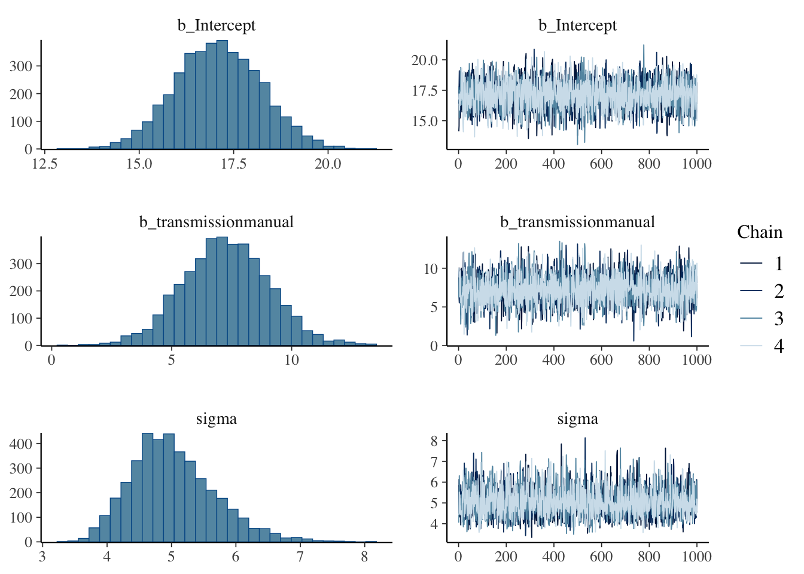
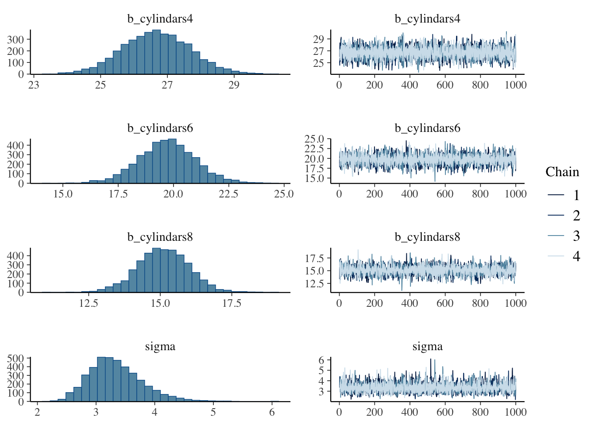
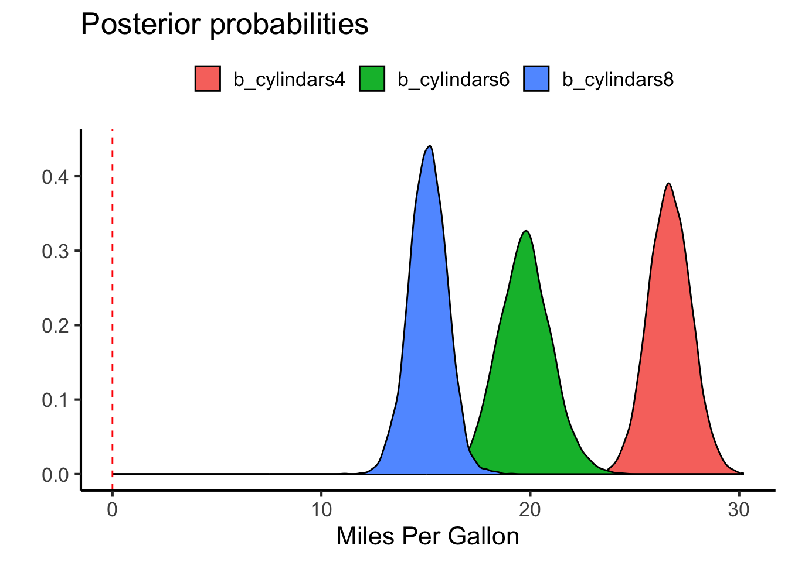
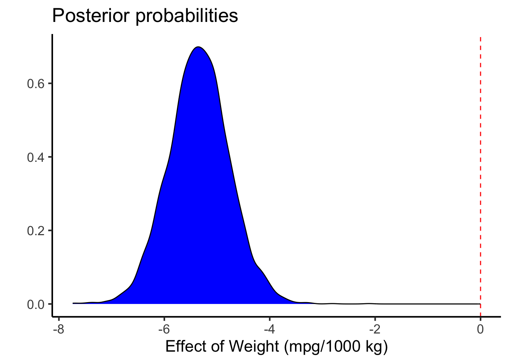
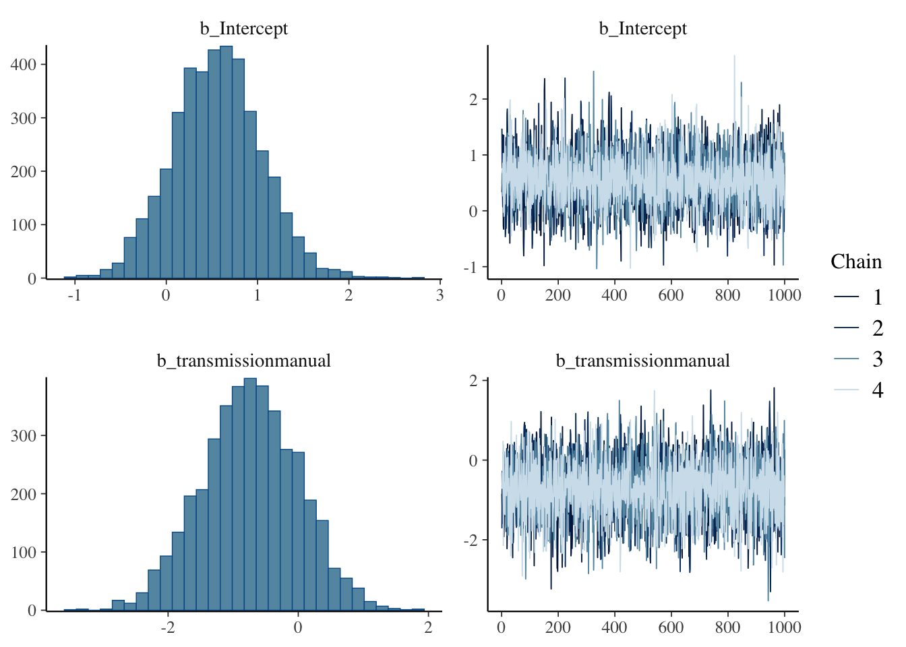
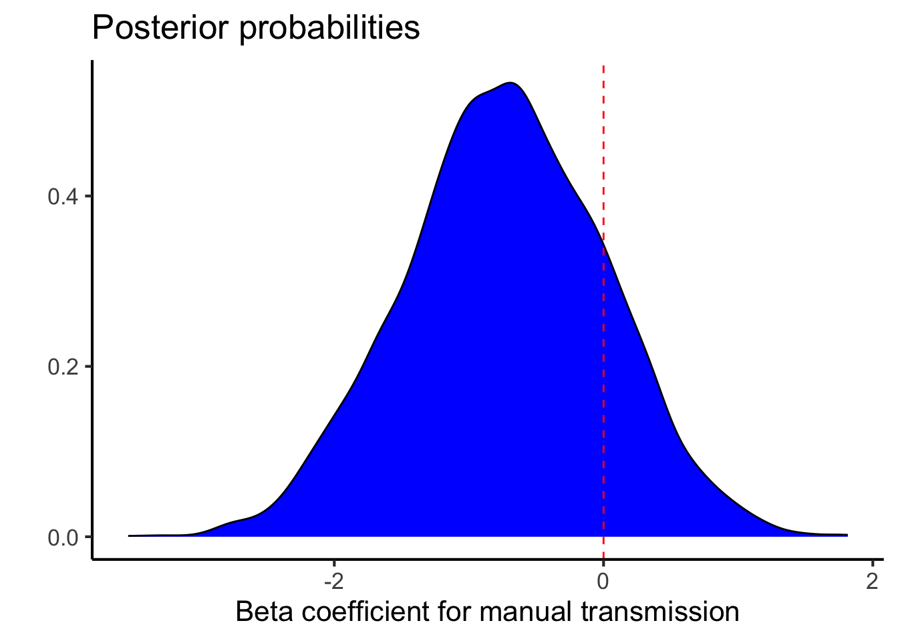

## Some Common Analyses

As a general rule we do four analyses fairly commonly in the Bridges Lab, summarized here based on the nature of the independent and dependent variables:

| Dependent Variable        | Independent Variable      | Analysis                                    |
|------------------------|--------------------------|-----------------------|
| Continuous                | Continuous                | Linear Regression                           |
| Continuous                | Counts (Yes/No or Groups) | Binomial Regression                         |
| Counts (Yes/No or Groups) | Continuous                | Pairwise Test (*t*-test/Mann-Whitney/ANOVA) |
| Counts (Yes/No or Groups) | Counts (Yes/No or Groups) | $\chi^2$ or Fisher's Test                   |

Lets take a Bayesian approach to each of these using the Mtcars dataset, which looks like this after a bit of fiddling.


::: {.cell}

```{.r .cell-code}
library(knitr)
library(dplyr)
mtcars.data <- 
  as.data.frame(mtcars) %>%
  mutate(transmission = factor(case_when(am==0~"automatic",
                           am==1~"manual")),
         engine=factor(case_when(vs==0~"V-Shaped",
                       vs==1~"Straight")),
         cylindars = factor(cyl))
  
kable(mtcars.data,caption="The mtcars dataset")
```

::: {.cell-output-display}


Table: The mtcars dataset

|                    |  mpg| cyl|  disp|  hp| drat|    wt|  qsec| vs| am| gear| carb|transmission |engine   |cylindars |
|:-------------------|----:|---:|-----:|---:|----:|-----:|-----:|--:|--:|----:|----:|:------------|:--------|:---------|
|Mazda RX4           | 21.0|   6| 160.0| 110| 3.90| 2.620| 16.46|  0|  1|    4|    4|manual       |V-Shaped |6         |
|Mazda RX4 Wag       | 21.0|   6| 160.0| 110| 3.90| 2.875| 17.02|  0|  1|    4|    4|manual       |V-Shaped |6         |
|Datsun 710          | 22.8|   4| 108.0|  93| 3.85| 2.320| 18.61|  1|  1|    4|    1|manual       |Straight |4         |
|Hornet 4 Drive      | 21.4|   6| 258.0| 110| 3.08| 3.215| 19.44|  1|  0|    3|    1|automatic    |Straight |6         |
|Hornet Sportabout   | 18.7|   8| 360.0| 175| 3.15| 3.440| 17.02|  0|  0|    3|    2|automatic    |V-Shaped |8         |
|Valiant             | 18.1|   6| 225.0| 105| 2.76| 3.460| 20.22|  1|  0|    3|    1|automatic    |Straight |6         |
|Duster 360          | 14.3|   8| 360.0| 245| 3.21| 3.570| 15.84|  0|  0|    3|    4|automatic    |V-Shaped |8         |
|Merc 240D           | 24.4|   4| 146.7|  62| 3.69| 3.190| 20.00|  1|  0|    4|    2|automatic    |Straight |4         |
|Merc 230            | 22.8|   4| 140.8|  95| 3.92| 3.150| 22.90|  1|  0|    4|    2|automatic    |Straight |4         |
|Merc 280            | 19.2|   6| 167.6| 123| 3.92| 3.440| 18.30|  1|  0|    4|    4|automatic    |Straight |6         |
|Merc 280C           | 17.8|   6| 167.6| 123| 3.92| 3.440| 18.90|  1|  0|    4|    4|automatic    |Straight |6         |
|Merc 450SE          | 16.4|   8| 275.8| 180| 3.07| 4.070| 17.40|  0|  0|    3|    3|automatic    |V-Shaped |8         |
|Merc 450SL          | 17.3|   8| 275.8| 180| 3.07| 3.730| 17.60|  0|  0|    3|    3|automatic    |V-Shaped |8         |
|Merc 450SLC         | 15.2|   8| 275.8| 180| 3.07| 3.780| 18.00|  0|  0|    3|    3|automatic    |V-Shaped |8         |
|Cadillac Fleetwood  | 10.4|   8| 472.0| 205| 2.93| 5.250| 17.98|  0|  0|    3|    4|automatic    |V-Shaped |8         |
|Lincoln Continental | 10.4|   8| 460.0| 215| 3.00| 5.424| 17.82|  0|  0|    3|    4|automatic    |V-Shaped |8         |
|Chrysler Imperial   | 14.7|   8| 440.0| 230| 3.23| 5.345| 17.42|  0|  0|    3|    4|automatic    |V-Shaped |8         |
|Fiat 128            | 32.4|   4|  78.7|  66| 4.08| 2.200| 19.47|  1|  1|    4|    1|manual       |Straight |4         |
|Honda Civic         | 30.4|   4|  75.7|  52| 4.93| 1.615| 18.52|  1|  1|    4|    2|manual       |Straight |4         |
|Toyota Corolla      | 33.9|   4|  71.1|  65| 4.22| 1.835| 19.90|  1|  1|    4|    1|manual       |Straight |4         |
|Toyota Corona       | 21.5|   4| 120.1|  97| 3.70| 2.465| 20.01|  1|  0|    3|    1|automatic    |Straight |4         |
|Dodge Challenger    | 15.5|   8| 318.0| 150| 2.76| 3.520| 16.87|  0|  0|    3|    2|automatic    |V-Shaped |8         |
|AMC Javelin         | 15.2|   8| 304.0| 150| 3.15| 3.435| 17.30|  0|  0|    3|    2|automatic    |V-Shaped |8         |
|Camaro Z28          | 13.3|   8| 350.0| 245| 3.73| 3.840| 15.41|  0|  0|    3|    4|automatic    |V-Shaped |8         |
|Pontiac Firebird    | 19.2|   8| 400.0| 175| 3.08| 3.845| 17.05|  0|  0|    3|    2|automatic    |V-Shaped |8         |
|Fiat X1-9           | 27.3|   4|  79.0|  66| 4.08| 1.935| 18.90|  1|  1|    4|    1|manual       |Straight |4         |
|Porsche 914-2       | 26.0|   4| 120.3|  91| 4.43| 2.140| 16.70|  0|  1|    5|    2|manual       |V-Shaped |4         |
|Lotus Europa        | 30.4|   4|  95.1| 113| 3.77| 1.513| 16.90|  1|  1|    5|    2|manual       |Straight |4         |
|Ford Pantera L      | 15.8|   8| 351.0| 264| 4.22| 3.170| 14.50|  0|  1|    5|    4|manual       |V-Shaped |8         |
|Ferrari Dino        | 19.7|   6| 145.0| 175| 3.62| 2.770| 15.50|  0|  1|    5|    6|manual       |V-Shaped |6         |
|Maserati Bora       | 15.0|   8| 301.0| 335| 3.54| 3.570| 14.60|  0|  1|    5|    8|manual       |V-Shaped |8         |
|Volvo 142E          | 21.4|   4| 121.0| 109| 4.11| 2.780| 18.60|  1|  1|    4|    2|manual       |Straight |4         |


:::
:::


## What is a Pairwise Testing Equivalent?

Lets start by testing if there is a relationship between one quantitative variables, the mpg (miles per gallon) and a categorical variable - transmission (manual or automatic transmission) using the default priors


::: {.cell}

```{.r .cell-code}
library(brms)
pairwise.fit <- brm(mpg~transmission,data=mtcars.data,
                    sample_prior = TRUE)
```
:::

::: {.cell}

```{.r .cell-code}
library(broom.mixed)
tidy(pairwise.fit) %>% kable(caption="Summary of model fit for mpg versus transmission")
```

::: {.cell-output-display}


Table: Summary of model fit for mpg versus transmission

|effect   |component |group    |term                           |  estimate| std.error|   conf.low| conf.high|
|:--------|:---------|:--------|:------------------------------|---------:|---------:|----------:|---------:|
|fixed    |cond      |NA       |(Intercept)                    | 17.097677| 1.1364917| 14.9012782| 19.316796|
|fixed    |cond      |NA       |transmissionmanual             |  7.264199| 1.8109926|  3.6689723| 10.864794|
|ran_pars |cond      |Residual |sd__Observation                |  5.028371| 0.6561548|  3.9331937|  6.495243|
|ran_pars |cond      |Residual |prior_sigma__NA.NA.prior_sigma |  5.913367| 6.6387586|  0.1846534| 22.336345|


:::

```{.r .cell-code}
plot(pairwise.fit)
```

::: {.cell-output-display}
{width=672}
:::

```{.r .cell-code}
hypothesis(pairwise.fit, "transmissionmanual>0") # testing for whether manual tramsmission has higher mpg
```

::: {.cell-output .cell-output-stdout}

```
Hypothesis Tests for class b:
                Hypothesis Estimate Est.Error CI.Lower CI.Upper Evid.Ratio
1 (transmissionmanual) > 0     7.26      1.81     4.35     10.2        Inf
  Post.Prob Star
1         1    *
---
'CI': 90%-CI for one-sided and 95%-CI for two-sided hypotheses.
'*': For one-sided hypotheses, the posterior probability exceeds 95%;
for two-sided hypotheses, the value tested against lies outside the 95%-CI.
Posterior probabilities of point hypotheses assume equal prior probabilities.
```


:::
:::


As you can see, this analysis estimates that the manual transmission has a 7.2641994 higher mpg ($\pm$ 1.8109926) with a very high Bayes Factor (\infty{}) and posterior probability (1).

The posterior distribution for the effect of a manual transmission is here:


::: {.cell}

```{.r .cell-code}
library(ggplot2)
as_draws_df(pairwise.fit) %>%
  ggplot(aes(x=b_transmissionmanual)) +
  geom_density(fill="blue") +
  geom_vline(xintercept=0,color="red",lty=2) +
  labs(y="",
       x="Effect of manual transmission (mpg)",
       title="Posterior probabilities") +
  theme_classic(base_size=16)
```

::: {.cell-output-display}
{width=672}
:::
:::


We didnt specify the model type (gausian is the default). We also used the default priors here, which were


::: {.cell}

```{.r .cell-code}
prior_summary(pairwise.fit) %>% kable(caption="Default priors for a pairwise analysis of mpg vs transmission in the mtcars data")
```

::: {.cell-output-display}


Table: Default priors for a pairwise analysis of mpg vs transmission in the mtcars data

|prior                   |class     |coef               |group |resp |dpar |nlpar |lb |ub |source  |
|:-----------------------|:---------|:------------------|:-----|:----|:----|:-----|:--|:--|:-------|
|                        |b         |                   |      |     |     |      |   |   |default |
|                        |b         |transmissionmanual |      |     |     |      |   |   |default |
|student_t(3, 19.2, 5.4) |Intercept |                   |      |     |     |      |   |   |default |
|student_t(3, 0, 5.4)    |sigma     |                   |      |     |     |      |0  |   |default |


:::
:::


This includes flat priors for the beta coefficients, student's *t* distributions for intercept (centered around the mean mpg) and residual error (centered around zero).

### How about an ANOVA

Lets say we want to test across groups (rather than testing effects between groups)
.  For that we can use the number of cylindars as a factor


::: {.cell}

```{.r .cell-code}
anova.fit <- brm(mpg~0+cylindars,data=mtcars.data, #zero makes sure each cylindar gets its own intercept
                    sample_prior = TRUE)
anova.fit.null <- brm(mpg~0,data=mtcars.data, #null model not including cylindars
                    sample_prior = TRUE)
```
:::


The analysis here is a little bit different than before.  We can still plot the posterior distributions for each model but the relevant test is now to compare the model with the cylindars to a null model, without that term.


::: {.cell}

```{.r .cell-code}
tidy(anova.fit) %>% kable(caption="Summary of model fit for mpg versus cylindars")
```

::: {.cell-output-display}


Table: Summary of model fit for mpg versus cylindars

|effect   |component |group    |term                           |  estimate| std.error|   conf.low| conf.high|
|:--------|:---------|:--------|:------------------------------|---------:|---------:|----------:|---------:|
|fixed    |cond      |NA       |cylindars4                     | 26.671540|  1.009890| 24.6931994| 28.684420|
|fixed    |cond      |NA       |cylindars6                     | 19.710334|  1.292718| 17.1888040| 22.281530|
|fixed    |cond      |NA       |cylindars8                     | 15.107150|  0.902260| 13.3049123| 16.826756|
|ran_pars |cond      |Residual |sd__Observation                |  3.338449|  0.454706|  2.5896345|  4.374084|
|ran_pars |cond      |Residual |prior_sigma__NA.NA.prior_sigma |  6.021950|  7.654006|  0.1700044| 23.006449|


:::

```{.r .cell-code}
plot(anova.fit)
```

::: {.cell-output-display}
{width=672}
:::

```{.r .cell-code}
# extracts the bayes factor comparing the models
bayes_factor(anova.fit,anova.fit.null) -> anova.bf 
```

::: {.cell-output .cell-output-stdout}

```
Iteration: 1
Iteration: 2
Iteration: 3
Iteration: 4
Iteration: 5
Iteration: 1
Iteration: 2
Iteration: 3
Iteration: 4
Iteration: 5
```


:::

```{.r .cell-code}
library(tidyr)
as_draws_df(anova.fit) %>%
  select(starts_with('b')) %>%
  pivot_longer(cols=everything(),
               names_to = "term",
               values_to="mpg") %>%
  ggplot(aes(x=mpg,fill=term)) +
  geom_density() +
  geom_vline(xintercept=0,color="red",lty=2) +
  labs(y="",
       x="Miles Per Gallon",
       title="Posterior probabilities") +
  scale_fill_discrete(name="") +
  theme_classic(base_size=16) +
  theme(legend.position="top")
```

::: {.cell-output-display}
{width=672}
:::
:::


In this case the Bayes Factor for the hypothesis that this term is relevant is 3.4878578\times 10^{28}.

We can still do post-hoc tests using the hypothesis command:


::: {.cell}

```{.r .cell-code}
rbind(hypothesis(anova.fit, "cylindars4>cylindars6")$hypothesis,
      hypothesis(anova.fit, "cylindars4>cylindars8")$hypothesis,
      hypothesis(anova.fit, "cylindars6>cylindars8")$hypothesis) %>%
  kable(caption="Pairwise hypothesis tests for cylindars on mpg")
```

::: {.cell-output-display}


Table: Pairwise hypothesis tests for cylindars on mpg

|Hypothesis                    |  Estimate| Est.Error| CI.Lower|  CI.Upper| Evid.Ratio| Post.Prob|Star |
|:-----------------------------|---------:|---------:|--------:|---------:|----------:|---------:|:----|
|(cylindars4)-(cylindars6) > 0 |  6.961206|  1.613525| 4.318895|  9.640136|        Inf|   1.00000|*    |
|(cylindars4)-(cylindars8) > 0 | 11.564389|  1.358335| 9.344448| 13.776835|        Inf|   1.00000|*    |
|(cylindars6)-(cylindars8) > 0 |  4.603184|  1.565119| 2.070603|  7.158059|   265.6667|   0.99625|*    |


:::
:::


## What is a Linear Regression Equivalent?

Lets start by testing if there is a relationship between two quantitative variables, the mpg (miles per gallon) and the weight (wt) using the default priors


::: {.cell}

```{.r .cell-code}
linear.fit <- brm(mpg~wt,data=mtcars,
                  sample_prior = TRUE)
```
:::


Lets see what this looks like


::: {.cell}

```{.r .cell-code}
prior_summary(linear.fit) %>% kable(caption="Prior summary for effects of weight on mpg")
```

::: {.cell-output-display}


Table: Prior summary for effects of weight on mpg

|prior                   |class     |coef |group |resp |dpar |nlpar |lb |ub |source  |
|:-----------------------|:---------|:----|:-----|:----|:----|:-----|:--|:--|:-------|
|                        |b         |     |      |     |     |      |   |   |default |
|                        |b         |wt   |      |     |     |      |   |   |default |
|student_t(3, 19.2, 5.4) |Intercept |     |      |     |     |      |   |   |default |
|student_t(3, 0, 5.4)    |sigma     |     |      |     |     |      |0  |   |default |


:::

```{.r .cell-code}
tidy(linear.fit) %>% kable(caption="Summary of model fit for mpg versus weight")
```

::: {.cell-output-display}


Table: Summary of model fit for mpg versus weight

|effect   |component |group    |term                           |  estimate| std.error|   conf.low| conf.high|
|:--------|:---------|:--------|:------------------------------|---------:|---------:|----------:|---------:|
|fixed    |cond      |NA       |(Intercept)                    | 37.257714| 1.9360071| 33.4151941| 40.982049|
|fixed    |cond      |NA       |wt                             | -5.341900| 0.5792852| -6.4596890| -4.176700|
|ran_pars |cond      |Residual |sd__Observation                |  3.160016| 0.4253177|  2.4736451|  4.126301|
|ran_pars |cond      |Residual |prior_sigma__NA.NA.prior_sigma |  5.960987| 6.6349369|  0.1906678| 22.410161|


:::

```{.r .cell-code}
plot(linear.fit)
```

::: {.cell-output-display}
{width=672}
:::

```{.r .cell-code}
hypothesis(linear.fit, "wt<0") # testing for whether weight has a negative effect on mpg
```

::: {.cell-output .cell-output-stdout}

```
Hypothesis Tests for class b:
  Hypothesis Estimate Est.Error CI.Lower CI.Upper Evid.Ratio Post.Prob Star
1   (wt) < 0    -5.34      0.58     -6.3    -4.41        Inf         1    *
---
'CI': 90%-CI for one-sided and 95%-CI for two-sided hypotheses.
'*': For one-sided hypotheses, the posterior probability exceeds 95%;
for two-sided hypotheses, the value tested against lies outside the 95%-CI.
Posterior probabilities of point hypotheses assume equal prior probabilities.
```


:::

```{.r .cell-code}
as_draws_df(linear.fit) %>%
  ggplot(aes(x=b_wt)) +
  geom_density(fill="blue") +
  geom_vline(xintercept=0,color="red",lty=2) +
  labs(y="",
       x="Effect of Weight (mpg/1000 kg)",
       title="Posterior probabilities") +
  theme_classic(base_size=16)
```

::: {.cell-output-display}
{width=672}
:::
:::


Notice that the priors were the same here (they are based on the dependent variable), and again there is a highly probable inverse relationship between mpg and weight (heavier cars get lower fuel economy).

### What if I am more interested in the R-squared?

To do this we can use the `bayes_R2` function.


::: {.cell}

```{.r .cell-code}
kable(bayes_R2(linear.fit),caption="Estimates for R2 between weight and mpg")
```

::: {.cell-output-display}


Table: Estimates for R2 between weight and mpg

|   |  Estimate| Est.Error|      Q2.5|    Q97.5|
|:--|---------:|---------:|---------:|--------:|
|R2 | 0.7417077| 0.0472553| 0.6189107| 0.797102|


:::

```{.r .cell-code}
r2.probs <- bayes_R2(linear.fit, summary=F) #summary false is to get the posterior probabilities
ggplot(data=r2.probs, aes(x=R2)) +
  geom_density(fill="blue") +
  geom_vline(xintercept=0,color="red",lty=2) +
  labs(y="",
       x="R2",
       title="Posterior probabilities") +
  lims(x=c(0,1)) +
  theme_classic(base_size=16)
```

::: {.cell-output-display}
{width=672}
:::
:::


## What is a Chi-Squared Equivalent

First lets do an example with a standard $\chi^2$ test (and a Fisher's test since the counts are quite low) on whether there is a relationship bewteen engine type and transmission type.


::: {.cell}

```{.r .cell-code}
library(tidyr) #for pivot wider
library(tibble) #for column to rowname
engine.trans.counts <-
  mtcars.data %>%
  group_by(engine,transmission) %>%
  count() %>%
  pivot_wider(names_from=transmission,values_from=n) %>%
  column_to_rownames('engine')

chisq.test(engine.trans.counts) %>% tidy %>% kable(caption="Chi-squared test for engine/transmission")
```

::: {.cell-output-display}


Table: Chi-squared test for engine/transmission

| statistic|   p.value| parameter|method                                                       |
|---------:|---------:|---------:|:------------------------------------------------------------|
| 0.3475355| 0.5555115|         1|Pearson's Chi-squared test with Yates' continuity correction |


:::

```{.r .cell-code}
fisher.test(engine.trans.counts) %>% tidy %>% kable(caption="Fisher's test for engine/transmission")
```

::: {.cell-output-display}


Table: Fisher's test for engine/transmission

| estimate|   p.value|  conf.low| conf.high|method                             |alternative |
|--------:|---------:|---------:|---------:|:----------------------------------|:-----------|
| 0.511233| 0.4726974| 0.0944144|  2.614145|Fisher's Exact Test for Count Data |two.sided   |


:::
:::


Both agree, not much of a relationship here. For the brms modelling we need to make a few changes. First, we will use a bernoulli distribution since our data is only zeros and ones, again we will use all the default priors.


::: {.cell}

```{.r .cell-code}
# Fit the model
counts.model <- brm(engine ~ transmission, 
           data = mtcars.data, 
           family = bernoulli())
```
:::


Lets look at these results


::: {.cell}

```{.r .cell-code}
prior_summary(counts.model) %>% kable(caption="Prior summary for effects of transmission on engine type")
```

::: {.cell-output-display}


Table: Prior summary for effects of transmission on engine type

|prior                |class     |coef               |group |resp |dpar |nlpar |lb |ub |source  |
|:--------------------|:---------|:------------------|:-----|:----|:----|:-----|:--|:--|:-------|
|                     |b         |                   |      |     |     |      |   |   |default |
|                     |b         |transmissionmanual |      |     |     |      |   |   |default |
|student_t(3, 0, 2.5) |Intercept |                   |      |     |     |      |   |   |default |


:::

```{.r .cell-code}
tidy(counts.model) %>% kable(caption="Summary of model fit for transmission versus engine type")
```

::: {.cell-output-display}


Table: Summary of model fit for transmission versus engine type

|effect |component |group |term               |   estimate| std.error|   conf.low| conf.high|
|:------|:---------|:-----|:------------------|----------:|---------:|----------:|---------:|
|fixed  |cond      |NA    |(Intercept)        |  0.5564512| 0.4845538| -0.3728695| 1.5250906|
|fixed  |cond      |NA    |transmissionmanual | -0.7365043| 0.7455498| -2.2076540| 0.7021128|


:::

```{.r .cell-code}
plot(counts.model)
```

::: {.cell-output-display}
{width=672}
:::

```{.r .cell-code}
hypothesis(counts.model, "transmissionmanual<0") # testing for whether weight has a negative effect on mpg
```

::: {.cell-output .cell-output-stdout}

```
Hypothesis Tests for class b:
                Hypothesis Estimate Est.Error CI.Lower CI.Upper Evid.Ratio
1 (transmissionmanual) < 0    -0.74      0.75    -1.99     0.45       5.05
  Post.Prob Star
1      0.83     
---
'CI': 90%-CI for one-sided and 95%-CI for two-sided hypotheses.
'*': For one-sided hypotheses, the posterior probability exceeds 95%;
for two-sided hypotheses, the value tested against lies outside the 95%-CI.
Posterior probabilities of point hypotheses assume equal prior probabilities.
```


:::

```{.r .cell-code}
as_draws_df(counts.model) %>%
  ggplot(aes(x=b_transmissionmanual)) +
  geom_density(fill="blue") +
  geom_vline(xintercept=0,color="red",lty=2) +
  labs(y="",
       x="Beta coefficient for manual transmission",
       title="Posterior probabilities") +
  theme_classic(base_size=16)
```

::: {.cell-output-display}
{width=672}
:::
:::


Now in this case there is moderate evidence for a negative relationship between transmnission and engine type ($\beta$=-0.7365043 $\pm$ 0.7455498) with a Bayes Factor of 5.0514372 and a Posterior Probability of 0.83475.

## What is a Binomial Regression Equivalent?

Lets now look at the relationsbip between transmission type (binomial variable) and weight (continuous variable). Again we will use a bernouli distribution (which will use, by default a logit link function)


::: {.cell}

```{.r .cell-code}
# Fit the model
binomial.fit <- brm(transmission ~ wt, 
           data = mtcars.data, 
           family = bernoulli())
```
:::

::: {.cell}

```{.r .cell-code}
prior_summary(binomial.fit) %>% kable(caption="Prior summary for effects of transmission on engine type")
```

::: {.cell-output-display}


Table: Prior summary for effects of transmission on engine type

|prior                |class     |coef |group |resp |dpar |nlpar |lb |ub |source  |
|:--------------------|:---------|:----|:-----|:----|:----|:-----|:--|:--|:-------|
|                     |b         |     |      |     |     |      |   |   |default |
|                     |b         |wt   |      |     |     |      |   |   |default |
|student_t(3, 0, 2.5) |Intercept |     |      |     |     |      |   |   |default |


:::

```{.r .cell-code}
tidy(binomial.fit) %>% kable(caption="Summary of model fit for transmission versus engine type")
```

::: {.cell-output-display}


Table: Summary of model fit for transmission versus engine type

|effect |component |group |term        |  estimate| std.error|  conf.low| conf.high|
|:------|:---------|:-----|:-----------|---------:|---------:|---------:|---------:|
|fixed  |cond      |NA    |(Intercept) | 14.822531|  5.646451|  6.143241| 27.985245|
|fixed  |cond      |NA    |wt          | -4.899447|  1.776671| -8.932556| -2.160662|


:::

```{.r .cell-code}
plot(binomial.fit)
```

::: {.cell-output-display}
{width=672}
:::

```{.r .cell-code}
hypothesis(binomial.fit, "wt<0") # testing for whether weight has a negative effect on mpg
```

::: {.cell-output .cell-output-stdout}

```
Hypothesis Tests for class b:
  Hypothesis Estimate Est.Error CI.Lower CI.Upper Evid.Ratio Post.Prob Star
1   (wt) < 0     -4.9      1.78     -8.1    -2.51        Inf         1    *
---
'CI': 90%-CI for one-sided and 95%-CI for two-sided hypotheses.
'*': For one-sided hypotheses, the posterior probability exceeds 95%;
for two-sided hypotheses, the value tested against lies outside the 95%-CI.
Posterior probabilities of point hypotheses assume equal prior probabilities.
```


:::

```{.r .cell-code}
as_draws_df(binomial.fit) %>%
  ggplot(aes(x=b_wt)) +
  geom_density(fill="blue") +
  geom_vline(xintercept=0,color="red",lty=2) +
  labs(y="",
       x="Beta coefficient for weight on transmission",
       title="Posterior probabilities") +
  theme_classic(base_size=16)
```

::: {.cell-output-display}
{width=672}
:::
:::


Again there is strong evidence that a higher weight makes an automatic transmission more likely.

Hopefully these examples helped, but a couple things since we used defaults.

Think closely about your priors, if you have a good reason to set them to something other than the default you should. In this case the defaults worked pretty well and as you can see are set based on the data that is input. These are generally very **weakly informative priors** and the modelling could be improved on by setting your own.

Also remember, nowhere in here was there a p-value. We could consider a posterior probability of \>0.95 our cutoff for significance if we prefer, but make sure to state this in your methods (along with your choice of priors and the package used.)

Note this script used some examples generated by [perplexity.ai](https://www.perplexity.ai/) and then modified further

# Session Info


::: {.cell}

```{.r .cell-code}
sessionInfo()
```

::: {.cell-output .cell-output-stdout}

```
R version 4.4.1 (2024-06-14)
Platform: x86_64-apple-darwin20
Running under: macOS Sonoma 14.6.1

Matrix products: default
BLAS:   /Library/Frameworks/R.framework/Versions/4.4-x86_64/Resources/lib/libRblas.0.dylib 
LAPACK: /Library/Frameworks/R.framework/Versions/4.4-x86_64/Resources/lib/libRlapack.dylib;  LAPACK version 3.12.0

locale:
[1] en_US.UTF-8/en_US.UTF-8/en_US.UTF-8/C/en_US.UTF-8/en_US.UTF-8

time zone: America/Detroit
tzcode source: internal

attached base packages:
[1] stats     graphics  grDevices utils     datasets  methods   base     

other attached packages:
[1] tibble_3.2.1        tidyr_1.3.1         ggplot2_3.5.1      
[4] broom.mixed_0.2.9.5 brms_2.21.0         Rcpp_1.0.12        
[7] dplyr_1.1.4         knitr_1.48         

loaded via a namespace (and not attached):
 [1] gtable_0.3.5         tensorA_0.36.2.1     xfun_0.45           
 [4] QuickJSR_1.3.1       processx_3.8.4       inline_0.3.19       
 [7] lattice_0.22-6       callr_3.7.6          vctrs_0.6.5         
[10] tools_4.4.1          ps_1.7.7             generics_0.1.3      
[13] stats4_4.4.1         parallel_4.4.1       fansi_1.0.6         
[16] pkgconfig_2.0.3      Matrix_1.7-0         checkmate_2.3.2     
[19] distributional_0.4.0 RcppParallel_5.1.8   lifecycle_1.0.4     
[22] farver_2.1.2         compiler_4.4.1       stringr_1.5.1       
[25] Brobdingnag_1.2-9    munsell_0.5.1        codetools_0.2-20    
[28] htmltools_0.5.8.1    bayesplot_1.11.1     yaml_2.3.9          
[31] pillar_1.9.0         furrr_0.3.1          StanHeaders_2.32.10 
[34] bridgesampling_1.1-2 abind_1.4-5          parallelly_1.38.0   
[37] nlme_3.1-164         posterior_1.6.0      rstan_2.32.6        
[40] tidyselect_1.2.1     digest_0.6.36        mvtnorm_1.2-5       
[43] stringi_1.8.4        future_1.34.0        reshape2_1.4.4      
[46] purrr_1.0.2          listenv_0.9.1        labeling_0.4.3      
[49] splines_4.4.1        forcats_1.0.0        fastmap_1.2.0       
[52] grid_4.4.1           colorspace_2.1-0     cli_3.6.3           
[55] magrittr_2.0.3       loo_2.8.0            pkgbuild_1.4.4      
[58] utf8_1.2.4           broom_1.0.6          withr_3.0.0         
[61] scales_1.3.0         backports_1.5.0      rmarkdown_2.27      
[64] matrixStats_1.3.0    globals_0.16.3       gridExtra_2.3       
[67] coda_0.19-4.1        evaluate_0.24.0      rstantools_2.4.0    
[70] rlang_1.1.4          glue_1.7.0           jsonlite_1.8.8      
[73] plyr_1.8.9           R6_2.5.1            
```


:::
:::
